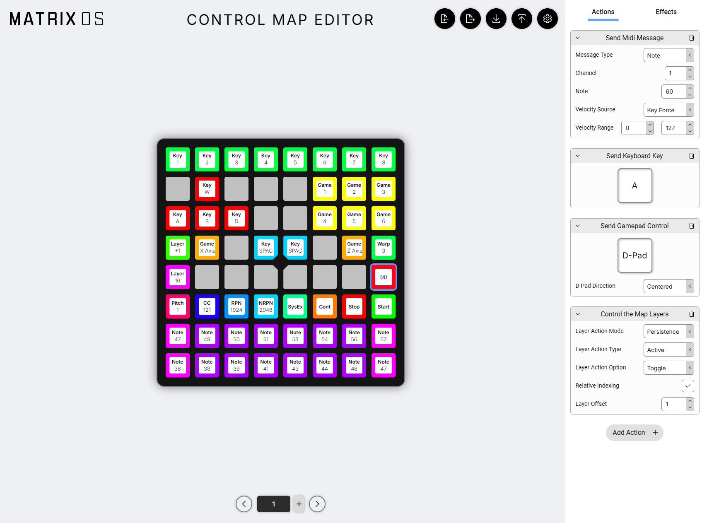

# Custom Control Map App

The Custom Control Map app is a powerful tool that allows you to create custom control maps for your Matrix OS device. You can create custom control maps using the [Matrix OS Custom Control Map Editor](https://edit.203.io).

:::warning
**This app is only available in the Matrix OS 2.6 beta version.** Documentation is still in progress.

Most features are easy to understand, but some may require additional explanation.

- Action Driven Color links color to the action state. In MIDI, if you select the toggle option, Color 1 of the action-driven color will be used if the toggle is in the "on" position.

**There are also some bugs that will be fixed before release. For example, the SysEx is currently not working.**
:::

## Web Editor

You can create custom control maps using the [Matrix OS Custom Control Map Editor](https://edit.203.io).

You can assign actions and effects to keys. You can also assign multiple actions to a single key, and they will be executed in sequence.

### Action

An action is a single operation that can be performed by the key action.

### Effect

An effect is a visual feedback that is displayed on the key when the action is performed. It can be triggered via key action or other events.
