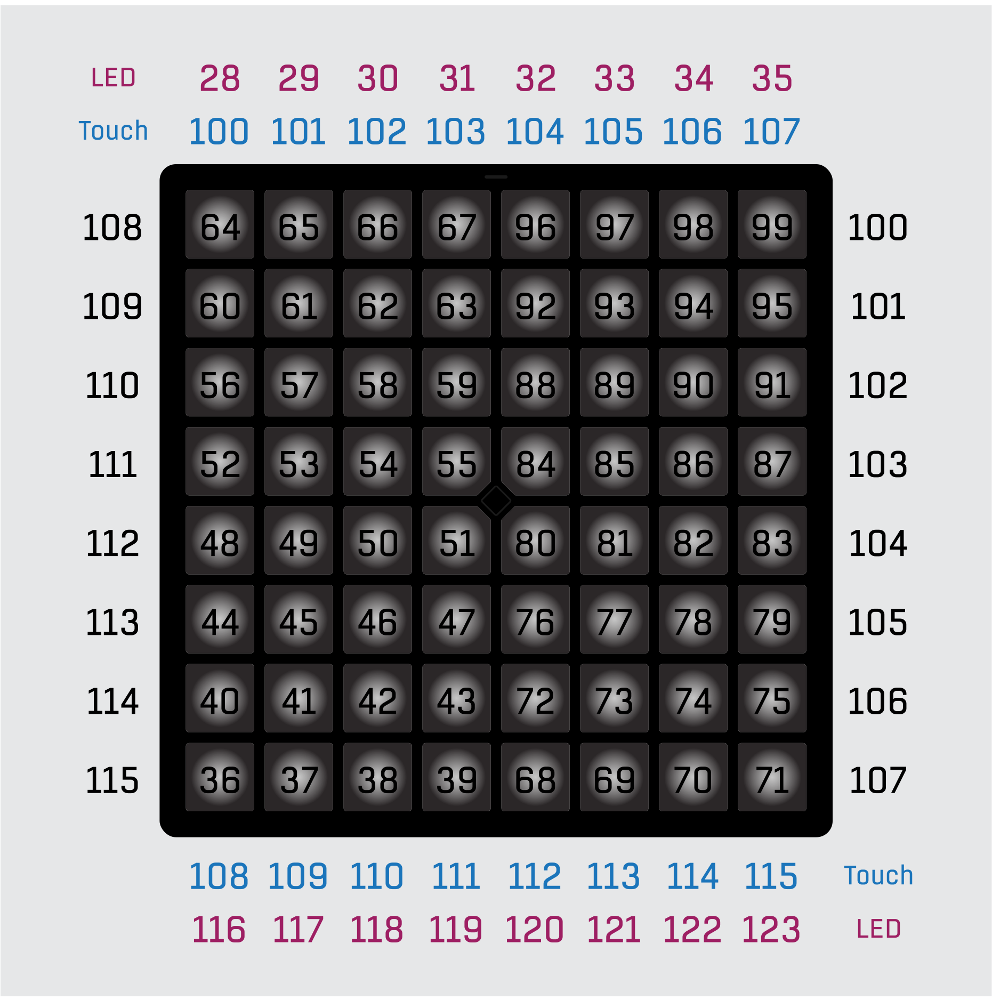

import MystrixVisualizer from '@site/src/components/MystrixVisualizer/MystrixVisualizer';
import PaletteVisualizer from '@site/src/components/PaletteVisualizer/PaletteVisualizer';

# Performance App

The Performance app is used as an user canvas standard MIDI signals.

It can be used to perform visual performance with Amethyst Player, Ableton Live, or Unipad; used as drumpad in any MIDI enabled DAW; or used as a canvas for your own DAW integration via standard MIDI protocol.

It sends standard MIDI signal with aftertouch so it should be compatible with any DAW that accepts MIDI if it is used as drum pad purpose.

When you first enter the application, you will see a blank canvas. You can click or hold on the function key to enter the action menu.

To exit performance app, enter action menu and hold down the function key. You will be brought back to the [application launcher](/docs/MatrixOS/ApplicationLauncher). (This is also how usually you exit an app in Matrix OS)

## Performance Canvas

## Action Menu
export function ActionMenu() {

    const uiElements = [
    {
        "name": "Flicker Reduction",
        "desc": "Enable or disable flicker reduction optimization.",
        "link": "#flicker-reduction",
        "elements": [
            {
                "pos": [0, 0],
                "color": "#A0FF00"
            }
        ]
    },
    {
        "name": "Custom Palettes",
        "desc": "View and edit custom palettes. If a custom palette is loaded, the palette slot will be lit up as cyan.",
        "link": "#color-palette",
        "elements": [
            {
                "pos": [2, 0],
                "size": [4, 1],
                "color": "#D0D0D0"
            }
        ]
    },
    {
        "name": "Velocity Sensitivity",
        "desc": "(Device with Force Sensitive Keypad only) Enable or disable velocity sensitivity.",
        "elements": [
            {
                "pos": [7, 0],
                "color": "#FFFFFF"
            }
        ]
    },
    {
        "name": "Brightness Control",
        "desc": "Tap to cycle through brightness levels. Hold to enter brightness control menu.",
        "link": "/docs/MatrixOS/SystemSettings#brightness-control",
        "elements": [
            {
                "pos": [3, 3],
                "size": [2, 2],
                "color": "#FFFFFF"
            }
        ]
    },
    {
        "name": "System Settings",
        "desc": "Enter the system settings.",
        "link": "/docs/MatrixOS/SystemSettings",
        "elements": [
            {
                "pos": [7, 5],
                "color": "#FFFFFF"
            }
        ]
    },
    {
        "name": "Touch Combo Keys",
        "desc": "Enable or disable touch combo keys feature.",
        "link": "#touchbar-combo-keys",
        "elements": [
            {
                "pos": [0, 4],
                "color": "#60FF00"
            }
        ]
    },
    {
        "name": "Menu Lock",
        "desc": "Enable or disable menu lock feature.",
        "link": "#Menu Lock",
        "elements": [
            {
                "pos": [0, 5],
                "color": "#FF0000"
            }
        ]
    },
    {
        "name": "Clear Canvas",
        "desc": "This clears LEDs on the performance canvas.",
        "elements": [
            {
                "pos": [3, 2],
                "size": [2, 1],
                "color": "#00FF00"
            }
        ]
    },
    {
        "name": "Rotate Device Left",
        "desc": "Rotate the device so that the top of the device is on the left side.",
        "link": "/docs/MatrixOS/SystemSettings#device-rotation",
        "elements": [
            {
                "pos": [2, 3],
                "size": [1, 2],
                "color": "#00FF00"
            }
        ]
    },
    {
        "name": "Rotate Device Down",
        "desc": "Rotate the device so that the top of the device is on the bottom side.",
        "link": "/docs/MatrixOS/SystemSettings#device-rotation",
        "elements": [
            {
                "pos": [3, 5],
                "size": [2, 1],
                "color": "#00FF00"
            }
        ]
    },
    {
        "name": "Rotate Device Right",
        "desc": "Rotate the device so that the top of the device is on the right side.",
        "link": "/docs/MatrixOS/SystemSettings#device-rotation",
        "elements": [
            {
                "pos": [5, 3],
                "size": [1, 2],
                "color": "#00FF00"
            }
        ]
    },
    {
        "name": "MIDI Control Pad",
        "desc": "Extra MIDI control pad for customizable controls. They are mapped to touchbar on the Mystrix, so they can be used as an alternative.",
        "link": "#factory-reset",
        "elements": [
            {
                "pos": [0, 6],
                "size": [8, 2],
                "color": "#ff00ff"
            }
        ]
    },
    {
        "name": "Go Back or Exit App",
        "desc": "Tap to go back to the performance canvas. Hold to exit the app.",
        "elements": [
            {
                "pos": ["c"]
            }
        ]
    }
];

    const uiName = "Action Menu"
    const uiDescription = "The action menu allows you to change the settings, modify palette, send MIDI controls inside Performance app."
    return <MystrixVisualizer 
    uiName = {uiName}
    uiDescription = {uiDescription}
    uiElements = {uiElements}
    />
}

<ActionMenu/>

### Detect Action Menu State on Host Applications
Performance App will send out a cc signal when the action menu is entered. (channel 1, cc 121, value 127 for enter, value 0 for exit),

## Note Layout

Note that the Mystrix only have two touchbars on the left and right. But the device can be rotated to have the touchbars on the top and bottom.

In that case. The right touchbar will be mapped to the top touchbar, and the left touchbar will be mapped to the bottom touchbar. However, the LED MiDI in note is seperated for the two touchbars MiDI out note.

### Touch Combo Keys
Touch Combo Key is an alternative way use the Myatrix's touch bar.

By default, the 16 touch bars are mapped to the 16 midi notes. When Touch Combo Keys is enabled, when any touch key is held, the left and right column of the keypad will be mapped to the left and right touch bar's original note.

This means that basically holding down the touch key will act as a note shift for the two column and make them act as a touch bar, similar to how control key works on computer keyboard.

## Flicker Reduction
Flicker Reduction is used when MIDI lightshow is causing flickers or when light is so fast it is higher than the device refresh rate.
It is recommended turn on only in Ableton Live.

## Color Palette
There are two built in color palettes, and 4 custom color palettes. 

You can edit the custom color palettes in the action menu.

### Built in palette 1
<PaletteVisualizer 
    palette = {[
    "#000000", "#3C0000", "#7D0000", "#BE0000",
    "#FF7D7D", "#FF0000", "#3C0C00", "#7D1C00",
    "#BE2C00", "#FF9D7D", "#FF3C00", "#3C1C00",
    "#7D3C00", "#BE5D00", "#FFBE7D", "#FF7D00",
    "#3C2C00", "#7D5D00", "#BE8D00", "#FFDE7D",
    "#FFBE00", "#3C3C00", "#7D7D00", "#BEBE00",
    "#FFFF7D", "#FFFF00", "#2C3C00", "#5D7D00",
    "#8DBE00", "#DEFF7D", "#BEFF00", "#1C3C00",
    "#3C7D00", "#5DBE00", "#BEFF7D", "#7DFF00",
    "#0C3C00", "#1C7D00", "#2CBE00", "#9DFF7D",
    "#3CFF00", "#003C00", "#007D00", "#00BE00",
    "#7DFF7D", "#00FF00", "#003C0C", "#007D1C",
    "#00BE2C", "#7DFF9D", "#00FF3C", "#003C1C",
    "#007D3C", "#00BE5D", "#7DFFBE", "#00FF7D",
    "#003C2C", "#007D5D", "#00BE8D", "#7DFFDE",
    "#00FFBE", "#003C3C", "#007D7D", "#00BEBE",
    "#7DFFFF", "#00FFFF", "#002C3C", "#005D7D",
    "#008DBE", "#7DDEFF", "#00BEFF", "#001C3C",
    "#003C7D", "#005DBE", "#7DBEFF", "#007DFF",
    "#000C3C", "#001C7D", "#002CBE", "#7D9DFF",
    "#003CFF", "#00003C", "#00007D", "#0000BE",
    "#7D7DFF", "#0000FF", "#0C003C", "#1C007D",
    "#2C00BE", "#9D7DFF", "#3C00FF", "#1C003C",
    "#3C007D", "#5D00BE", "#BE7DFF", "#7D00FF",
    "#2C003C", "#5D007D", "#8D00BE", "#DE7DFF",
    "#BE00FF", "#3C003C", "#7D007D", "#BE00BE",
    "#FF7DFF", "#FF00FF", "#3C002C", "#7D005D",
    "#BE008D", "#FF7DDE", "#FF00BE", "#3C001C",
    "#7D003C", "#BE005D", "#FF7DBE", "#FF007D",
    "#3C000C", "#7D001C", "#BE002C", "#FF7D9D",
    "#FF003C", "#242424", "#484848", "#6D6D6D",
    "#919191", "#B6B6B6", "#DADADA", "#FFFFFF"
]}/>

### Built in palette 2 - Legacy Palette

<PaletteVisualizer 
    palette = {[
  "#000000", "#3f3f3f", "#7f7f7f", "#ffffff", "#ff3f3f", "#ff0000", "#7f0000", "#3f0000",
  "#ffbf6f", "#ff3f00", "#7f1f00", "#3f0f00", "#ffaf2f", "#ffff00", "#7f7f00", "#3f3f00",
  "#7fff2f", "#4fff00", "#2f7f00", "#173f00", "#4fff3f", "#00ff00", "#007f00", "#003f00",
  "#4fff4f", "#00ff1f", "#007f0f", "#003f07", "#4fff5f", "#00ff5f", "#007f2f", "#003f17",
  "#4fffbf", "#00ff9f", "#007f4f", "#003f27", "#4fbfff", "#00afff", "#00577f", "#002f3f",
  "#4f7fff", "#0057ff", "#002f7f", "#00173f", "#2f1fff", "#0000ff", "#00007f", "#00003f",
  "#5f3fff", "#2f00ff", "#17007f", "#0f003f", "#ff3fff", "#ff00ff", "#7f007f", "#3f003f",
  "#ff3f6f", "#ff004f", "#7f002f", "#3f001f", "#ff0f00", "#9f3f00", "#7f4f00", "#2f2f00",
  "#003f00", "#003f1f", "#001f6f", "#0000ff", "#003f3f", "#1f00bf", "#5f3f4f", "#1f0f17",
  "#ff0000", "#bfff2f", "#afef00", "#5fff00", "#0f7f00", "#00ff5f", "#009fff", "#002fff",
  "#1f00ff", "#5f00ef", "#af1f7f", "#2f0f00", "#ff2f00", "#7fdf00", "#6fff1f", "#00ff00",
  "#3fff2f", "#5fef6f", "#3fffcf", "#5f8fff", "#2f4fcf", "#6f4fdf", "#df1fff", "#ff005f",
  "#ff4f00", "#bfaf00", "#8fff00", "#7f5f00", "#3f2f00", "#00470f", "#0f4f1f", "#17172f",
  "#171f5f", "#5f3717", "#7f0000", "#df3f2f", "#df470f", "#ffbf1f", "#9fdf2f", "#6faf0f",
  "#17172f", "#dfdf6f", "#7fef8f", "#9f9fff", "#8f6fff", "#3f3f3f", "#6f6f6f", "#dfffff",
  "#9f0000", "#370000", "#17cf00", "#003f00", "#bfaf00", "#3f2f00", "#af4f00", "#4f0f00"
]}/>

### Upload Custom Palette

You can upload 4 custom palettes to the app for channel 3, 4, 5, and 6. You can edit the custom palettes in the action menu or upload custom palettes.

Community Member Dovitate has made a custom palette uploader Max Patch for the Performance App. You can find it at [203 Systems Discord - Community Release](https://discord.com/channels/503413248704380930/1266490246770462770)

You can find the more custom palette from [Kaskobi's website](https://www.kaskobi.com/palettes)

## SysEx API

Sysex API provided more advanced control over the canvas than regular MIDI signals. Including real RGB LED color and faster LED fill. 

The Mystrix SysEx header is

> 0xF0 0x00 0x02 0x03 0x4D 0x58
 
### RGB LED Color - 0x5E

The RGB LED color command is used to set the color of the LED on the canvas.

The command is
> `Header` 0x5E `POS` `R` `G` `B` [`POS2` `R` `G` `B`] [`POS3` `R` `G` `B`] ... 0xF7

- `POS` is the position of the LED on the canvas. It's Y * 10 + X. The (1, 1) is the lower corner of the grid and (8, 8) is the top right corner. You can access the underglow by using X Y 0 or 8. In additionally you can do a global fill by using pos 0, row fill by 100 + Y, and column fill by 110 + X.
- `R`, `G`, `B` is the red, green, and blue value of the LED. The value is 0-63.

You can repeat the `POS R G B` (for a reasonable amount of times) to set multiple LEDs at once.

### RGB LED Color Batch Fill - 0x5F

The RGB LED color batch fill command is used to set the color of the LED on the canvas in a faster way.

The command is
> `Header` 0x5F `R` `G` `B` `POS` [`POS2`] [`POS3`] [`POS4`] ... 0xF7

- `R`, `G`, `B` is the red, green, and blue value of the LED. The value is 0-63.
- `POS` is the position of the LED on the canvas. It's Y * 10 + X. The (1, 1) is the lower corner of the grid and (8, 8) is the top right corner. You can access the underglow by using X Y 0 or 8. In additionally you can do a global fill by using pos 0, row fill by 100 + Y, and column fill by 110 + X.

You can repeat the `POS` (for a reasonable amount of times) to set multiple LEDs at once.

### Upload Custom Palette - 0x41

The Upload Custom Palette command is used to customize LED color palettes. The process includes three subcommands (`0x7B`, `0x3D`, and `0x7D`), allowing for initialization, data upload, and finalization. The command structure is as follows:

The command is

> `Header` 0x41 SubCommand Data ... 0xF7

- **SubCommand**: Specifies the stage of the upload process:
  - `0x7B`: Uploading Start
  - `0x3D`: Uploading Write
  - `0x7D`: Uploading End

#### **Uploading Start (0x7B)**

Marks the beginning of the palette upload process.

> `Header` 0x41 0x7B 0xF7

#### **Uploading Write (0x3D)**
Writes color data to the specified palette.

> `Header` 0x41 0x3D `PaletteID` `Index` `R` `G` `B`  [`PaletteID2` `Index2` `R` `G` `B` ] ... 0xF7

- `PaletteID`: Specifies the target palette. (0-3)
- `Index`: The slot in the palette to update. (0-127)
- `R, G, B`: The red, green, and blue components of the color. (0-63)

The RGB values are remapped from 6-bit to 8-bit resolution internally for enhanced color precision.

#### **Uploading End (0x7D)**
Completes the palette upload process and saves the changes to non-volatile storage.

> `Header` 0x41 0x7D 0xF7 
