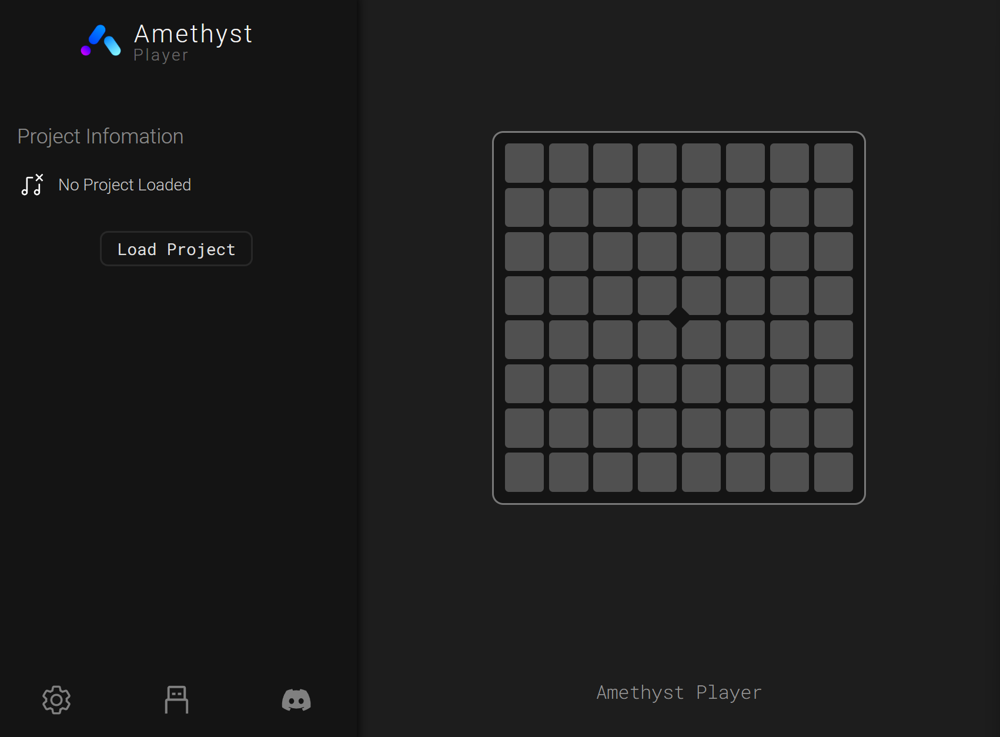
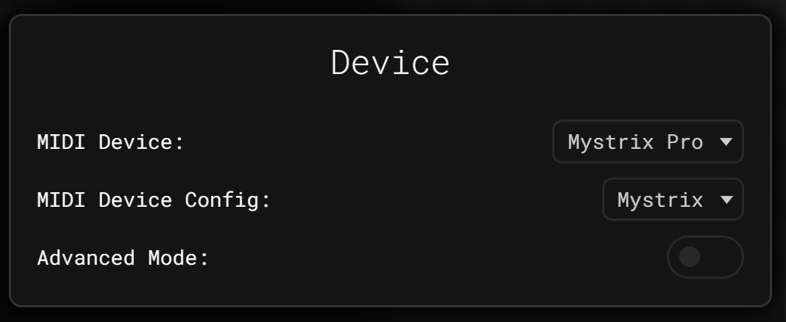
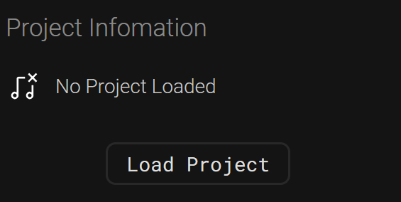
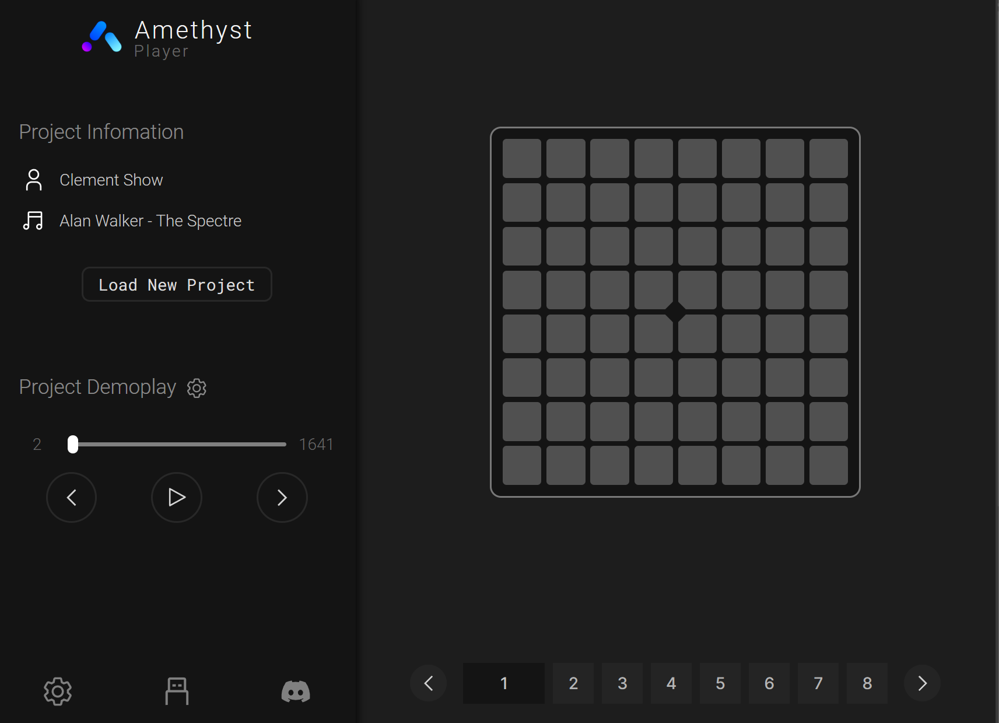
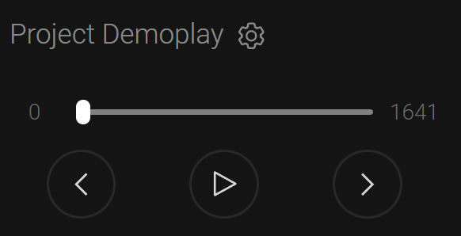
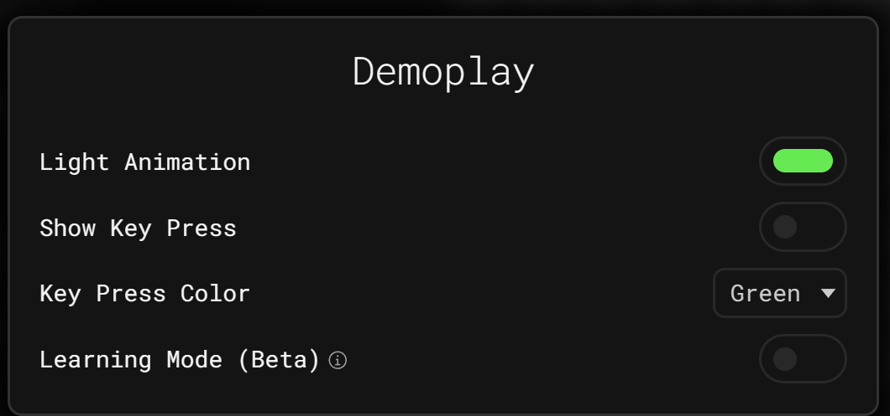
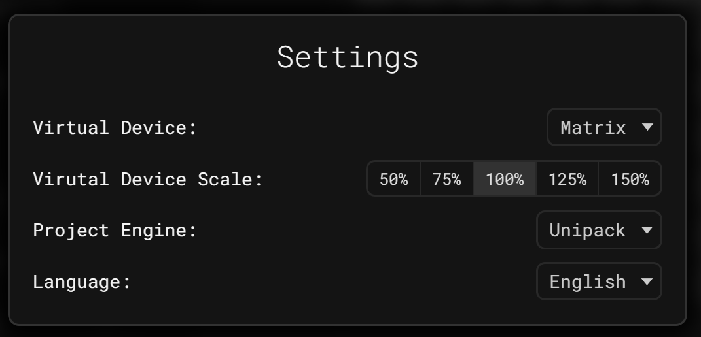

# Amethyst Player

Amethyst Player is 203 System's in house web application for performing lightshows.

It's available on [play.203.io](https://play.203.io) as a webapp or PWA (Progressive Web App).

Currently it supports playing Unipad Projects (Unipack) online, you will be able to connect Mystrix or other compatible midi controller with web midi enabled browser to start playing.

## How to Use
1. Open the Website.
2. Connect your Mystrix and enter the [Performance APP](/docs/MatrixOS/Applications/Performance).
3. Check and Config the device via the USB icon on the bottom of the screen or bottom of the side bar.

4. Click the load project button and select the zip file.

5. If nothing went wrong, your project should be now ready to play

## Demo Play
If your project supports demo play, then the Project Demoplay widge should show up in the UI. You can adjust the play time, next step, prev step, play, and pause.

In addition, you can click the gear icon on the right of "Project Demoplay" to modify settings.

## Settings
You can adjust settings via the gear icon in the UI.

In the setting, you can change the virtual device, size of the virtual device, [Project Engine](#supported-lightshow-engines), and language.

## Hotkeys
| Key            | Function                 |
|----------------|--------------------------|
| **R**          | Load Project             |
| **Space** / **P**  | Play & Pause Demoplay     |
| **Left** / **A**   | Demoplay move backward   |
| **Right** / **D**  | Demoplay move forward    |
| **Up** / **W** / **E** | Next Layer               |
| **Down** / **S** / **Q**| Previous Layer           |
| **Any Number Key**          | Switch to Layer   |
| **Enter** / **F** / **ESC** | Toggle Full Screen   |
| **Z**          | Show Player Setting      |
| **X**          | Show Device Setting      |
| **C**          | Show Demoplay Setting    |

## Get Unipad Projects (UniPack)

You can get Unipad Projects from Youtube videos. Heres are some great ones for example:
- [Alan Walker - The Spectre by Clement Show](https://www.youtube.com/watch?v=-96eVsFJW-M)
- [ BLACKPINK (블랙핑크) - 뚜두뚜두 (DDU-DU-DDU-DU) by JinCreeMusic](https://www.youtube.com/watch?v=QTsq8lM9uqg)
- [Porter Robinson & Madeon - Shelter by Clement Show](https://www.youtube.com/watch?v=TnPQg9h6Un0)
- [Fonglee, Moudelica & Silkorr - Midnight City by YamiEDM](https://www.youtube.com/watch?v=KYiaGXlBxLE)
- [Alan Walker - Darkside by Yubo Ki](https://www.youtube.com/watch?v=ZtSGblqfmKQ)

Or from some sites like https://unipad.dbkims.com/.

## Supported Lightshow Engines

Amethyst Player is currently supporting Unipack. Superpad Lights Engine is currently under alpha, getting superpad lights projects is also really tricky.

In the future, we will release out own lightshow project format dubbed Universal Lightshow Project, or ULP to unify things with better compatibility and more options.