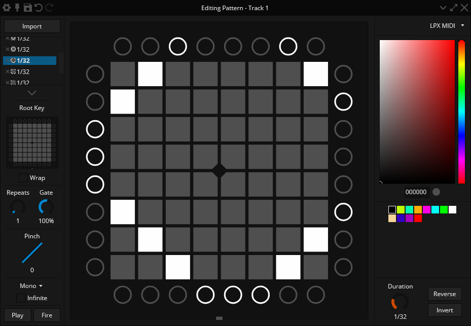

# Apollo Studio

[Apollo Studio](https://apollo.mat1jaczyyy.com/) by [mat1jaczyyy](https://mat1jaczyyy.com/) is a very powerful tool for creating and performing lightshows.

Using Apollo, you will be able to unlock and utilize many capabilities of the Mystrix, such as full RGB access to the LEDs.

## Set Up

1. Ensure you have [Ableton Live](https://www.ableton.com/live/) installed, as you will likely want to use Apollo Studio in conjunction with it. You will need to set up your Mystrix with Ableton beforehand. Refer to [Ableton Live - Set Up](/docs/Mystrix/UsageExamples/LightshowPerformance/AbletonLive) for guidance.
2. Download and install [Apollo Studio](https://apollo.mat1jaczyyy.com/) on your computer.
3. Connect your Mystrix and enter the [Performance APP](/docs/MatrixOS/Applications/Performance).
4. Launch both Apollo Studio and Ableton Live.
5. Open an existing project or create a new one.
6. Configure the MIDI port for the track. Note that Windows does not support multi-client MIDI, so you will need to select `MIDIIN2 (Mystrix)` to avoid conflicts with Ableton Live.

<!-- show the process in a gif? -->

For detailed instructions on using Apollo Studio, refer to the [Apollo Documentation](https://github.com/mat1jaczyyy/apollo-studio/wiki) or watch the [Video Tutorials](https://www.youtube.com/playlist?list=PLKC4R3X00beY0aB_f_ZIa3shqJX7do4mH).
