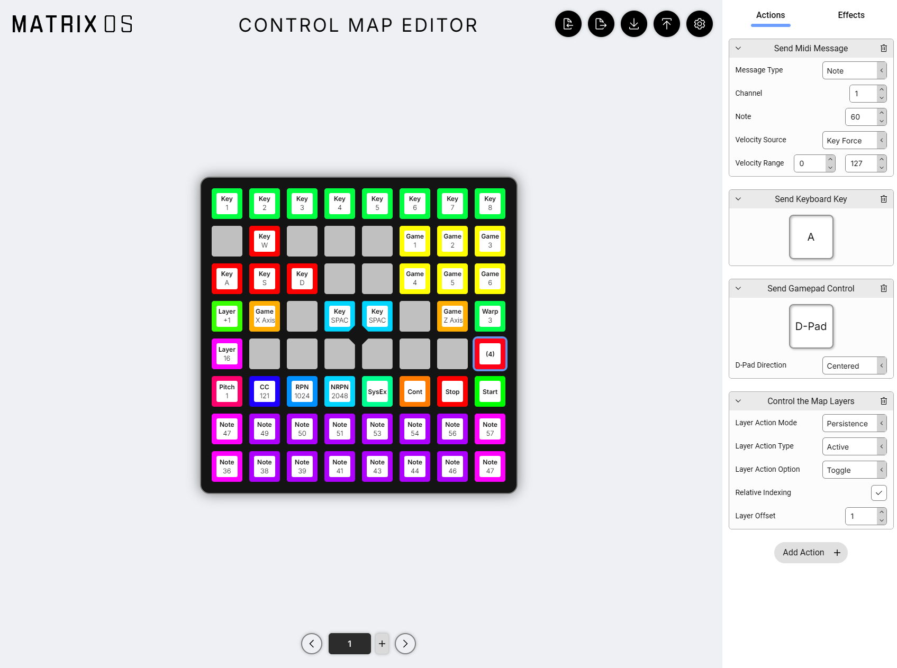

import MystrixVisualizer from "@site/src/components/MystrixVisualizer/MystrixVisualizer";

# Custom Control Map App

The Custom Control Map app is a powerful tool that allows you to create custom control maps for your Matrix OS device. You can create custom control maps using the [Matrix OS Custom Control Map Editor](https://edit.203.io).

:::warning
Documentation is still in progress.

Most features are easy to understand, but some may require additional explanation.

- Action Driven Color links color to the action state. In MIDI, if you select the toggle option, Color 1 of the action-driven color will be used if the toggle is in the "on" position.

**There are also some bugs that will be fixed before release. For example, the SysEx is currently not working.**
:::

## Web Editor

You can create custom control maps using the [Matrix OS Custom Control Map Editor](https://edit.203.io).

You can assign actions and effects to keys. You can also assign multiple actions to a single key, and they will be executed in sequence.

### Action

An action is a single operation that can be performed by the key action.

### Effect

An effect is a visual feedback that is displayed on the key when the action is performed. It can be triggered via key action or other events.

## Action Menu

When you hold the Function Key while in Custom Control Map mode, you enter the Action Menu which provides access to various settings and controls.

export function ActionMenu() {
    const uiElements = [
        {
            "name": "Activated Layers",
            "desc": "Shows which layers are currently active in your control map. (The example visualize shows 4 layers in the map, layer 1~3 are enabled, layer 4 is disabled. Layer 3 effects are shown, layer 3 actions and any lower enabled layers are trigger-able)",
            "elements": [
                {
                    "pos": [0, 0],
                    "size": [8, 2],
                    "color": "#C0C0C0"
                },
                {
                    "pos": [0, 0],
                    "size": [3, 1],
                    "color": "#00FFFF"
                },
                {
                    "pos": [3, 0],
                    "color": "#00C0C0"
                }
            ]
        },
        {
            "name": "Menu Lock",
            "desc": "Toggle to lock/unlock the menu access",
            "elements": [
                {
                    "pos": [0, 2],
                    "color": "#00FF00"
                }
            ]
        },
        {
            "name": "Reload",
            "desc": "Reload the current control map configuration. (So layer configuration are reset to default of the map)",
            "elements": [
                {
                    "pos": [0, 5],
                    "color": "#FF0000"
                }
            ]
        },
        {
            "name": "System Setting",
            "desc": "Open the system settings menu",
            "link": "/docs/MatrixOS/SystemSettings",
            "elements": [
                {
                    "pos": [7, 5],
                    "color": "#FFFFFF"
                }
            ]
        },
        {
            "name": "Layer Passthrough",
            "desc": "Configure which layers allow passthrough of actions. (The example visualize shows 3 layers in the map, layer 1 are passthrough disabled, layer 2 is enabled. So action on empty spot of Layer 3 will trigger layer 1 actions)",
            "elements": [
                  {
                    "pos": [0, 6],
                    "size": [8, 2],
                    "color": "#C0C0C0"
                },
                {
                    "pos": [2, 6],
                    "size": [2, 1],
                    "color": "#C000C0"
                },
                {
                    "pos": [0, 6],
                    "size": [2, 1],
                    "color": "#FF00FF"
                }
            ]
        }
    ];

    const uiName = "Custom Control Map - Action Menu"
    const uiDescription = "The Action Menu provides access to control map settings, layer management, and system functions. Access by holding the Function Key."
    return <MystrixVisualizer
    uiName = {uiName}
    uiDescription = {uiDescription}
    uiElements = {uiElements}
    />
}

<ActionMenu />
