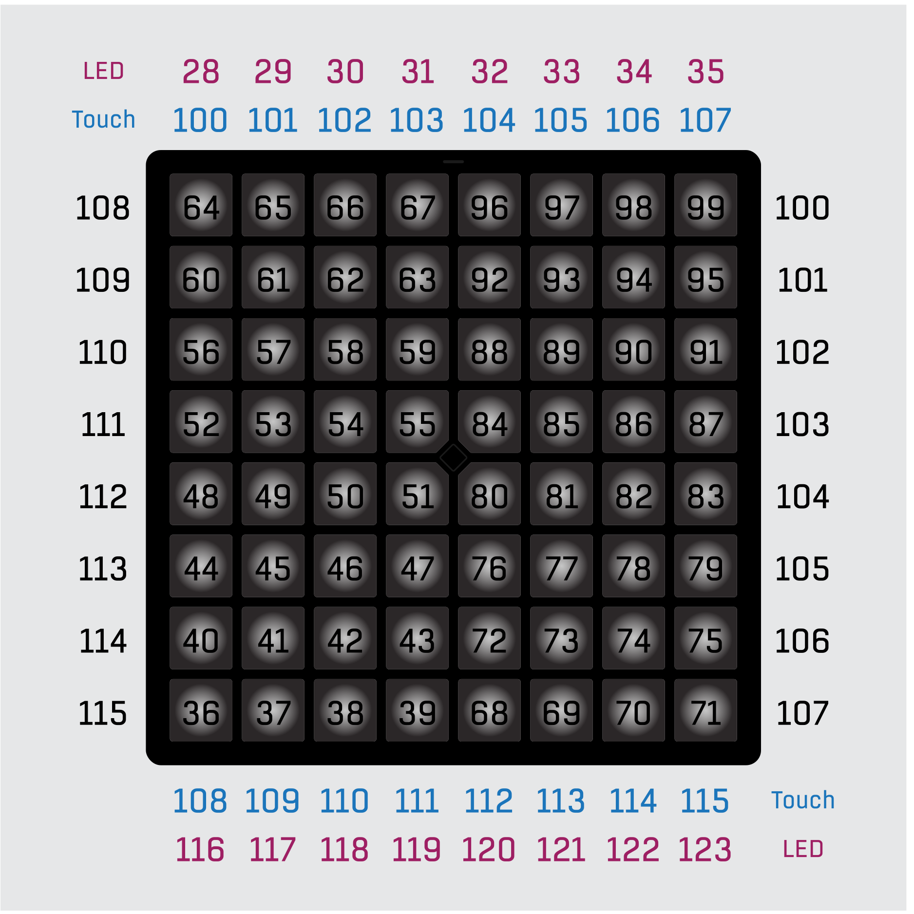

import MystrixVisualizer from "@site/src/components/MystrixVisualizer/MystrixVisualizer";
import PaletteVisualizer from "@site/src/components/PaletteVisualizer/PaletteVisualizer";

# 表演应用

表演应用作为标准 MIDI 信号的用户操作界面。

它可以与 Amethyst Player、Ableton Live 或 Unipad 等配合进行视觉演出；在任何支持 MIDI 的 DAW 中用作打击垫；或通过标准 MIDI 协议与你的 DAW 集成。

它发送带有触后的标准 MIDI 信号，确保与任何支持 MIDI 的 DAW 完全兼容。

初次进入应用时，会看到一个空白界面。可点击或按住功能键进入操作菜单。

要退出表演应用，请进入操作菜单并按住功能键。将返回到[应用启动器](/docs/MatrixOS/ApplicationLauncher)。这是 Matrix OS 中退出应用的标准方法。

## 演出画布

## 操作菜单

export function ActionMenu() {

    const uiElements = [
    {
        "name": "闪烁抑制",
        "desc": "启用或禁用闪烁抑制优化。",
        "link": "#flicker-reduction",
        "elements": [
            {
                "pos": [0, 0],
                "color": "#AAFF00"
            }
        ]
    },
    {
        "name": "自定义调色板 1",
        "desc": "查看和编辑自定义调色板1。如果已加载自定义调色板，调色板插槽将以青色点亮。",
        "link": "#color-palette",
        "elements": [
            {
                "pos": [2, 0],
                "color": "#00FFFF"
            }
        ]
    },
    {
        "name": "自定义调色板 2",
        "desc": "查看和编辑自定义调色板2。如果已加载自定义调色板，调色板插槽将以青色点亮。",
        "link": "#color-palette",
        "elements": [
            {
                "pos": [3, 0],
                "color": "#00FFFF"
            }
        ]
    },
    {
        "name": "自定义调色板 3",
        "desc": "查看和编辑自定义调色板3。如果已加载自定义调色板，调色板插槽将以青色点亮。",
        "link": "#color-palette",
        "elements": [
            {
                "pos": [4, 0],
                "color": "#00FFFF"
            }
        ]
    },
    {
        "name": "自定义调色板 4",
        "desc": "查看和编辑自定义调色板4。如果已加载自定义调色板，调色板插槽将以青色点亮。",
        "link": "#color-palette",
        "elements": [
            {
                "pos": [5, 0],
                "color": "#00FFFF"
            }
        ]
    },
    {
        "name": "力度感应",
        "desc": "（仅限配备压力敏感键盘的设备）启用或禁用力度感应。",
        "elements": [
            {
                "pos": [7, 0],
                "color": "#00FFFF"
            }
        ]
    },
    {
        "name": "触摸组合键",
        "desc": "启用或禁用触摸组合键功能。",
        "link": "#touchbar-combo-keys",
        "elements": [
            {
                "pos": [0, 2],
                "color": "#FF00FF"
            }
        ]
    },
    {
        "name": "菜单锁定",
        "desc": "启用或禁用菜单锁定功能。",
        "link": "#menu-lock",
        "elements": [
            {
                "pos": [0, 3],
                "color": "#00FF00"
            }
        ]
    },
    {
        "name": "清空画布",
        "desc": "清除演出画布上的LED灯光。",
        "elements": [
            {
                "pos": [0, 5],
                "color": "#FF0000"
            }
        ]
    },
    {
        "name": "系统设置",
        "desc": "进入系统设置。",
        "link": "/docs/MatrixOS/SystemSettings",
        "elements": [
            {
                "pos": [7, 5],
                "color": "#FFFFFF"
            }
        ]
    },
    {
        "name": "MIDI控制板",
        "desc": "用于可自定义控制的额外MIDI控制板。它们映射到魔矩上的触摸条，因此可以作为替代方案使用。",
        "elements": [
            {
                "pos": [0, 6],
                "size": [8, 2],
                "color": "#FF00FF"
            }
        ]
    },
    {
        "name": "返回或退出应用",
        "desc": "轻触返回演出画布。长按退出应用。",
        "elements": [
            {
                "pos": ["c"]
            }
        ]
    }

];

    const uiName = "操作菜单"
    const uiDescription = "操作菜单允许你在表演应用中更改设置、修改调色板和发送MIDI控制。"
    return <MystrixVisualizer
    uiName = {uiName}
    uiDescription = {uiDescription}
    uiElements = {uiElements}
    />

}

<ActionMenu />

### 在主机应用程序中检测操作菜单状态

表演应用在进入操作菜单时会发送CC信号（`通道1`，`CC 121`，进入时值为`127`，退出时值为`0`）。

## 音符布局

:::note
请注意，魔矩设备系列在左侧和右侧有两个触摸条。但是，设备可以旋转以将触摸条放在顶部和底部。

在这种方向下，右侧触摸条将映射到顶部触摸条，左侧触摸条将映射到底部触摸条。请注意，LED MIDI输入音符与两个触摸条的MIDI输出音符是分离的。
:::

### 触摸组合键

触摸组合键提供了使用魔矩触摸条的替代方法。

默认情况下，16个触摸条映射到16个MIDI音符。当启用触摸组合键时，按住任何触摸键将把键盘的左列和右列映射到左右触摸条的原始音符。

这意味着按住触摸键将作为两列的音符切换，使它们像触摸条一样工作，类似于计算机键盘上控制键的工作方式。

## 闪烁抑制

闪烁抑制用于MIDI灯光秀导致闪烁或灯光速度超过设备刷新率的情况。建议仅在魔矩与Ableton Live配合使用时启用此功能。

## 菜单锁定

菜单锁定通过要求功能键按住更长时间才能打开菜单来防止意外进入操作菜单。

## 调色板

有两个内置调色板和四个自定义调色板。

你可以在操作菜单中编辑自定义调色板。

### 内置调色板 1

<PaletteVisualizer
  palette={[
    "#000000",
    "#3C0000",
    "#7D0000",
    "#BE0000",
    "#FF7D7D",
    "#FF0000",
    "#3C0C00",
    "#7D1C00",
    "#BE2C00",
    "#FF9D7D",
    "#FF3C00",
    "#3C1C00",
    "#7D3C00",
    "#BE5D00",
    "#FFBE7D",
    "#FF7D00",
    "#3C2C00",
    "#7D5D00",
    "#BE8D00",
    "#FFDE7D",
    "#FFBE00",
    "#3C3C00",
    "#7D7D00",
    "#BEBE00",
    "#FFFF7D",
    "#FFFF00",
    "#2C3C00",
    "#5D7D00",
    "#8DBE00",
    "#DEFF7D",
    "#BEFF00",
    "#1C3C00",
    "#3C7D00",
    "#5DBE00",
    "#BEFF7D",
    "#7DFF00",
    "#0C3C00",
    "#1C7D00",
    "#2CBE00",
    "#9DFF7D",
    "#3CFF00",
    "#003C00",
    "#007D00",
    "#00BE00",
    "#7DFF7D",
    "#00FF00",
    "#003C0C",
    "#007D1C",
    "#00BE2C",
    "#7DFF9D",
    "#00FF3C",
    "#003C1C",
    "#007D3C",
    "#00BE5D",
    "#7DFFBE",
    "#00FF7D",
    "#003C2C",
    "#007D5D",
    "#00BE8D",
    "#7DFFDE",
    "#00FFBE",
    "#003C3C",
    "#007D7D",
    "#00BEBE",
    "#7DFFFF",
    "#00FFFF",
    "#002C3C",
    "#005D7D",
    "#008DBE",
    "#7DDEFF",
    "#00BEFF",
    "#001C3C",
    "#003C7D",
    "#005DBE",
    "#7DBEFF",
    "#007DFF",
    "#000C3C",
    "#001C7D",
    "#002CBE",
    "#7D9DFF",
    "#003CFF",
    "#00003C",
    "#00007D",
    "#0000BE",
    "#7D7DFF",
    "#0000FF",
    "#0C003C",
    "#1C007D",
    "#2C00BE",
    "#9D7DFF",
    "#3C00FF",
    "#1C003C",
    "#3C007D",
    "#5D00BE",
    "#BE7DFF",
    "#7D00FF",
    "#2C003C",
    "#5D007D",
    "#8D00BE",
    "#DE7DFF",
    "#BE00FF",
    "#3C003C",
    "#7D007D",
    "#BE00BE",
    "#FF7DFF",
    "#FF00FF",
    "#3C002C",
    "#7D005D",
    "#BE008D",
    "#FF7DDE",
    "#FF00BE",
    "#3C001C",
    "#7D003C",
    "#BE005D",
    "#FF7DBE",
    "#FF007D",
    "#3C000C",
    "#7D001C",
    "#BE002C",
    "#FF7D9D",
    "#FF003C",
    "#242424",
    "#484848",
    "#6D6D6D",
    "#919191",
    "#B6B6B6",
    "#DADADA",
    "#FFFFFF",
  ]}
/>

### 内置调色板 2 - 旧版调色板

<PaletteVisualizer
  palette={[
    "#000000",
    "#3f3f3f",
    "#7f7f7f",
    "#ffffff",
    "#ff3f3f",
    "#ff0000",
    "#7f0000",
    "#3f0000",
    "#ffbf6f",
    "#ff3f00",
    "#7f1f00",
    "#3f0f00",
    "#ffaf2f",
    "#ffff00",
    "#7f7f00",
    "#3f3f00",
    "#7fff2f",
    "#4fff00",
    "#2f7f00",
    "#173f00",
    "#4fff3f",
    "#00ff00",
    "#007f00",
    "#003f00",
    "#4fff4f",
    "#00ff1f",
    "#007f0f",
    "#003f07",
    "#4fff5f",
    "#00ff5f",
    "#007f2f",
    "#003f17",
    "#4fffbf",
    "#00ff9f",
    "#007f4f",
    "#003f27",
    "#4fbfff",
    "#00afff",
    "#00577f",
    "#002f3f",
    "#4f7fff",
    "#0057ff",
    "#002f7f",
    "#00173f",
    "#2f1fff",
    "#0000ff",
    "#00007f",
    "#00003f",
    "#5f3fff",
    "#2f00ff",
    "#17007f",
    "#0f003f",
    "#ff3fff",
    "#ff00ff",
    "#7f007f",
    "#3f003f",
    "#ff3f6f",
    "#ff004f",
    "#7f002f",
    "#3f001f",
    "#ff0f00",
    "#9f3f00",
    "#7f4f00",
    "#2f2f00",
    "#003f00",
    "#003f1f",
    "#001f6f",
    "#0000ff",
    "#003f3f",
    "#1f00bf",
    "#5f3f4f",
    "#1f0f17",
    "#ff0000",
    "#bfff2f",
    "#afef00",
    "#5fff00",
    "#0f7f00",
    "#00ff5f",
    "#009fff",
    "#002fff",
    "#1f00ff",
    "#5f00ef",
    "#af1f7f",
    "#2f0f00",
    "#ff2f00",
    "#7fdf00",
    "#6fff1f",
    "#00ff00",
    "#3fff2f",
    "#5fef6f",
    "#3fffcf",
    "#5f8fff",
    "#2f4fcf",
    "#6f4fdf",
    "#df1fff",
    "#ff005f",
    "#ff4f00",
    "#bfaf00",
    "#8fff00",
    "#7f5f00",
    "#3f2f00",
    "#00470f",
    "#0f4f1f",
    "#17172f",
    "#171f5f",
    "#5f3717",
    "#7f0000",
    "#df3f2f",
    "#df470f",
    "#ffbf1f",
    "#9fdf2f",
    "#6faf0f",
    "#17172f",
    "#dfdf6f",
    "#7fef8f",
    "#9f9fff",
    "#8f6fff",
    "#3f3f3f",
    "#6f6f6f",
    "#dfffff",
    "#9f0000",
    "#370000",
    "#17cf00",
    "#003f00",
    "#bfaf00",
    "#3f2f00",
    "#af4f00",
    "#4f0f00",
  ]}
/>

### 上传自定义调色板

你可以为通道3、4、5和6上传四个自定义调色板。你可以在操作菜单中编辑自定义调色板或上传自定义调色板。

社区成员Dovitate为表演应用创建了一个自定义调色板上传器Max Patch。你可以在[203 Systems Discord - 社区发布](https://discord.com/channels/503413248704380930/1266490246770462770)中找到它。

你可以在[Kaskobi的网站](https://www.kaskobi.com/palettes)上找到更多自定义调色板。

## SysEx API

SysEx API提供比常规MIDI信号更高级的画布控制，包括真正的RGB LED颜色和更快的LED填充。

魔矩SysEx头部是：

> 0xF0 0x00 0x02 0x03 0x4D 0x58

### RGB LED颜色 - 0x5E

RGB LED颜色命令用于设置画布上LED的颜色。

命令是：

> `Header` 0x5E `POS` `R` `G` `B` [`POS2` `R` `G` `B`] [`POS3` `R` `G` `B`] ... 0xF7

- `POS`是LED在画布上的位置。它是Y \* 10 + X。(1, 1)是网格的左下角，(8, 8)是右上角。你可以通过使用X Y 0或8来访问底光。此外，你可以通过使用位置0进行全局填充，通过100 + Y进行行填充，通过110 + X进行列填充。
- `R`、`G`、`B`是LED的红、绿、蓝值。值范围是0-63。

你可以重复`POS R G B`（合理次数）来同时设置多个LED。

### RGB LED颜色批量填充 - 0x5F

RGB LED颜色批量填充命令用于以更快的方式设置画布上LED的颜色。

命令是：

> `Header` 0x5F `R` `G` `B` `POS` [`POS2`] [`POS3`] [`POS4`] ... 0xF7

- `R`、`G`、`B`是LED的红、绿、蓝值。值范围是0-63。
- `POS`是LED在画布上的位置。它是Y \* 10 + X。(1, 1)是网格的左下角，(8, 8)是右上角。你可以通过使用X Y 0或8来访问底光。此外，你可以通过使用位置0进行全局填充，通过100 + Y进行行填充，通过110 + X进行列填充。

你可以重复`POS`（合理次数）来同时设置多个LED。

### 上传自定义调色板 - 0x41

上传自定义调色板命令用于自定义LED颜色调色板。该过程包括三个子命令（`0x7B`、`0x3D`和`0x7D`），允许初始化、数据上传和完成。命令结构如下：

命令是：

> `Header` 0x41 SubCommand Data ... 0xF7

- **SubCommand**: 指定上传过程的阶段：
  - `0x7B`: 上传开始
  - `0x3D`: 上传写入
  - `0x7D`: 上传结束

#### **上传开始 (0x7B)**

标记调色板上传过程的开始。

> `Header` 0x41 0x7B 0xF7

#### **上传写入 (0x3D)**

将颜色数据写入指定的调色板。

> `Header` 0x41 0x3D `PaletteID` `Index` `R` `G` `B` [`PaletteID2` `Index2` `R` `G` `B`] ... 0xF7

- `PaletteID`: 指定目标调色板 (0-3)。
- `Index`: 调色板中要更新的槽位 (0-127)。
- `R, G, B`: 颜色的红、绿、蓝分量 (0-63)。

RGB值在内部从6位重新映射到8位分辨率以增强颜色精度。

#### **上传结束 (0x7D)**

完成调色板上传过程并将更改保存到非易失性存储器。

> `Header` 0x41 0x7D 0xF7
