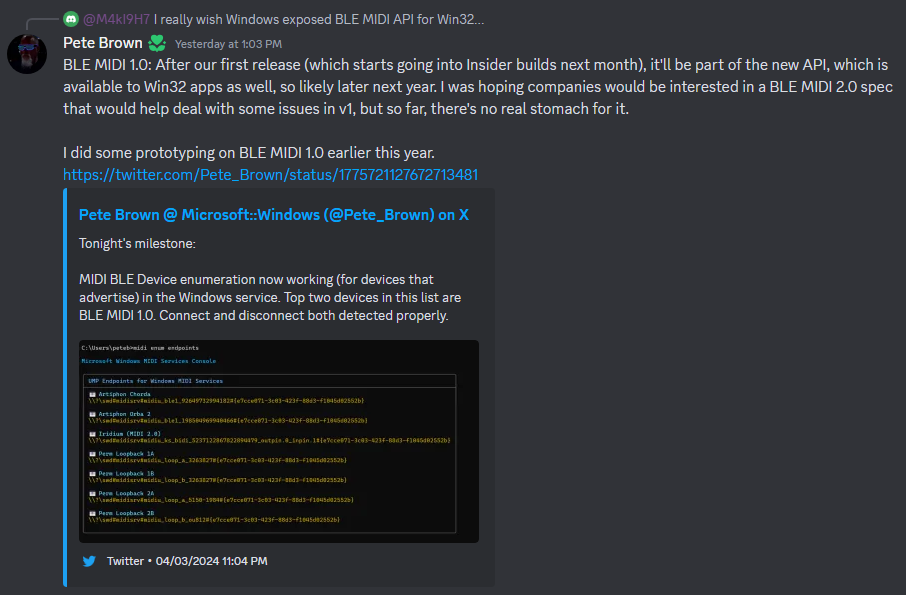

# 蓝牙 MIDI

魔矩支持蓝牙 MIDI，允许你将魔矩无线连接到你的设备。你可以在[设备设置](/docs/Mystrix/MystrixSpecific/DeviceSettings)中开启和关闭蓝牙 MIDI。

## iOS

在支持的应用程序中，你应该能够看到蓝牙 MIDI 设备菜单。在此菜单中，你应该看到魔矩设备。选择它以连接。

例如，请查看[如何将魔矩连接到 GarageBand](https://support.apple.com/guide/garageband-iphone/a-bluetooth-midi-device-touch-instruments-chse356a0321/ios)。

## Android

你需要一个应用程序将魔矩连接到你的 Android 设备。我们建议为此目的使用 [Bluetooth MIDI Connect](https://play.google.com/store/apps/details?id=bluetooth.midi.connect&hl=en_US)。

## macOS

请参阅[在 Mac 上的音频 MIDI 设置中设置蓝牙 MIDI 设备](https://support.apple.com/guide/audio-midi-setup/set-up-bluetooth-midi-devices-ams33f013765/mac)以获取说明。

## Windows

Windows 目前对蓝牙 MIDI 的支持有限。蓝牙 MIDI 仅在 UWP 应用程序中受支持，这意味着你只能在 Windows 商店应用程序中使用它，而不能在你的 DAW 或浏览器中使用。

有一些变通方法，但不推荐，因为它们复杂且不稳定。如果你想尝试，这里有一个[指南](http://newbodyfresher.linclip.com/how-to-use-with-daw)。

不过，这个情况可能很快就会有所改善。Windows 的 MIDI 系统工程师（也是魔矩用户）正在开发支持蓝牙 MIDI 的新系统。如果有更新，文档也会同步更新新的指南！

