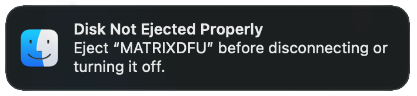

import MystrixVisualizer from "@site/src/components/MystrixVisualizer/MystrixVisualizer";
import DocLink from "@site/src/components/DocLink/DocLink";

# 更新 Matrix OS

## 进入操作系统更新模式

魔矩可以通过两种方式进入操作系统更新模式：

1. 使用<DocLink to="/docs/MatrixOS/SystemSettings">设置菜单</DocLink>左下角的红色按钮。
2. 在插入魔矩时按住功能键（中间按钮）。（如果无法启动到操作系统，这是备用方法）

应该在魔矩上看到一个箭头。

如果箭头是**红色**，表示设备未通过 USB 连接。

如果箭头是**绿色**，表示设备已通过 USB 连接并准备接收新操作系统。

<!-- this has to be there and not at the top cause than it breaks spaces in the navigation -->

export function ArrowGreen() {
const uiElements = [
    {
        "name": "箭头",
        "desc": "如果箭头是绿色，表示设备已通过 USB 连接并准备接收新操作系统；如果箭头是红色，表示设备未通过 USB 连接。",
        "elements": [
            {
                "pos": [3, 2],
                "size": [2, 4],
                "color": "#00FF00"
            },
            {
                "pos": [2, 4],
                "size": [4, 1],
                "color": "#00FF00"
            }
        ]
    }
];

    const uiName = "已连接";
    const uiDescription = "魔矩处于操作系统更新模式并已通过 USB 连接时显示的动画。";
    return <MystrixVisualizer
    uiName = {uiName}
    uiDescription = {uiDescription}
    uiElements = {uiElements}
    />

}

<ArrowGreen />

## 上传新操作系统

你需要一个新的固件文件来更新你的魔矩。你可以在 [Matrix OS GitHub 的发布区](https://github.com/203-Systems/MatrixOS/releases) 找到它们。

魔矩将在你的主机设备上显示为 USB 大容量存储驱动器。只需将所需操作系统的 UF2 文件复制到此驱动器中即可。

你的魔矩应该开始显示蓝色箭头动画。更新完成后，魔矩将自动重启到新操作系统。

:::info[注意]
如果你使用的是 Mac，你可能会收到魔矩被错误弹出的警告。

你可以忽略此警告。
:::

## 降级 Matrix OS

:::danger[降级 Matrix OS]
虽然你可以降级 Matrix OS，但这不被推荐，因为降级的操作系统可能会清除所有用户数据。如果你将操作系统降级到与你的设备不兼容的版本，你可能无法启动到操作系统。
:::
