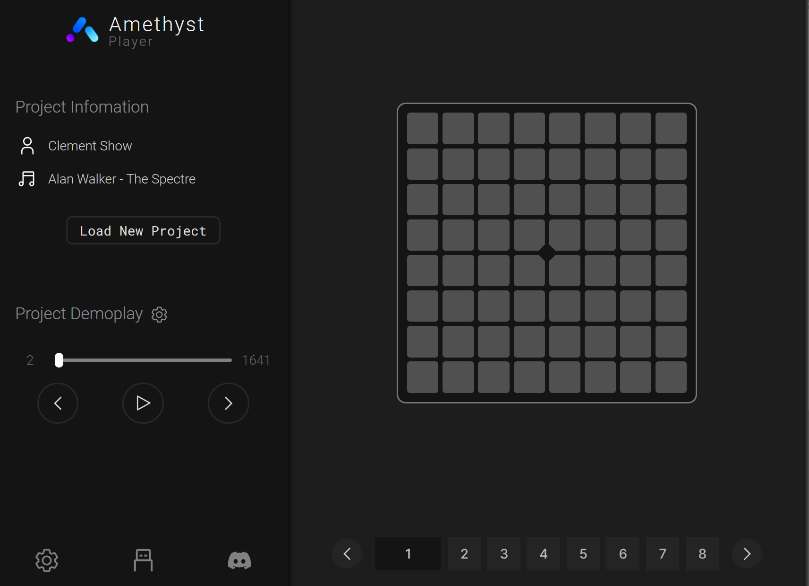
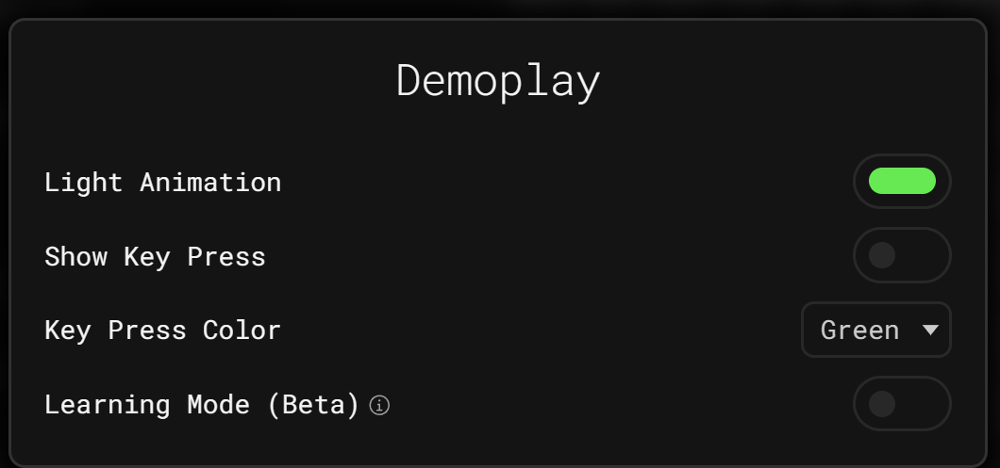
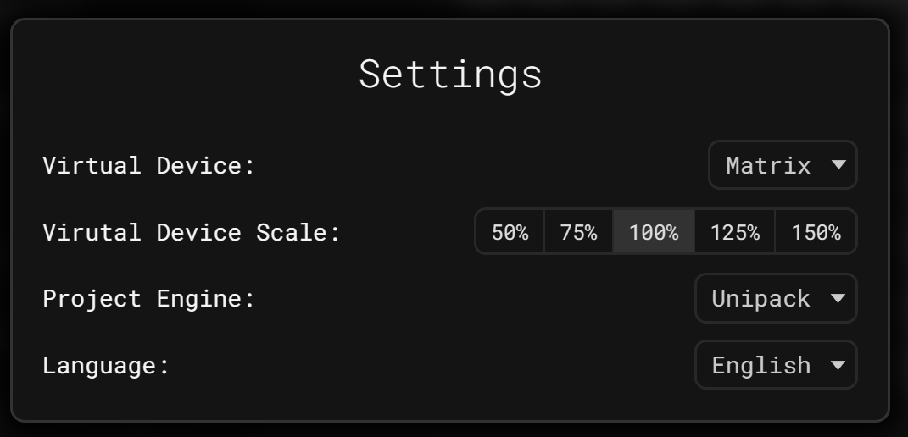

import DocLink from "@site/src/components/DocLink/DocLink";

# Amethyst Player

Amethyst Player 是 203 Systems 的内部网页应用，用于演奏灯光秀表演。

它作为 Web 应用或 PWA（Progressive Web App）可在 [play.203.io](https://play.203.io) 上使用。

目前支持在线播放 Unipad 项目（Unipack）。您可以使用[支持 Web MIDI 的浏览器](https://developer.mozilla.org/en-US/docs/Web/API/MIDIAccess#Browser_compatibility)连接魔矩或其他兼容的 MIDI 控制器开始播放。

## 使用方法

1. 打开网站。
2. 连接您的魔矩并进入 <DocLink to="/docs/MatrixOS/Applications/Performance">Performance 应用</DocLink>。
3. 通过屏幕底部或侧边栏底部的 USB 图标检查和配置设备。

 4. 点击 `加载项目` 按钮并选择 zip 文件。

5. 如果一切正确，你的项目现在应该准备好播放了。

## 演示播放

如果项目支持演示播放，`项目演示播放`组件将会显示在用户界面中。您可以调整播放时间、下一步、上一步、播放和暂停。

此外，你可以点击 `项目演示播放` 右侧的齿轮图标来修改设置。

## 设置

您可以通过用户界面中的齿轮图标调整设置。

在设置中，你可以更改虚拟设备、虚拟设备的大小、[项目引擎](#支持的灯光秀引擎) 和语言。

## 热键

| 按键                        | 功能               |
| --------------------------- | ------------------ |
| **R**                       | 加载项目           |
| **空格键** / **P**          | 播放和暂停演示播放 |
| **左箭头** / **A**          | 演示播放向后移动   |
| **右箭头** / **D**          | 演示播放向前移动   |
| **上箭头** / **W** / **E**  | 下一图层           |
| **下箭头** / **S** / **Q**  | 上一图层           |
| **任意数字键**              | 切换到图层         |
| **回车** / **F** / **ESC**  | 切换全屏           |
| **Z**                       | 显示播放器设置     |
| **X**                       | 显示设备设置       |
| **C**                       | 显示演示播放设置   |

## 获取 Unipad 项目（UniPack）

您可以从 YouTube 视频中获取 Unipad 项目。以下是一些精彩的例子：

- [Alan Walker - The Spectre by Clement Show](https://www.youtube.com/watch?v=-96eVsFJW-M)
- [BLACKPINK (블랙핑크) - 뚜두뚜두 (DDU-DU-DDU-DU) by JinCreeMusic](https://www.youtube.com/watch?v=QTsq8lM9uqg)
- [Porter Robinson & Madeon - Shelter by Clement Show](https://www.youtube.com/watch?v=TnPQg9h6Un0)
- [Fonglee, Moudelica & Silkorr - Midnight City by YamiEDM](https://www.youtube.com/watch?v=KYiaGXlBxLE)
- [Alan Walker - Darkside by Yubo Ki](https://www.youtube.com/watch?v=ZtSGblqfmKQ)

~~或从 [Unipad DB Kims](https://unipad.dbkims.com/) 等网站。~~ （目前已停止服务）

## 支持的灯光秀引擎

- **Unipack**：Amethyst Player 目前支持 Unipack 项目。
- **Superpad Lights 引擎**：该引擎目前处于 Alpha 测试阶段，获取 Superpad Lights 项目较为困难。

## 未来的灯光秀引擎

- **通用灯光秀项目（ULP）**：未来，我们将发布我们自己的灯光秀项目格式，称为通用灯光秀项目（ULP），以统一并提供更好的兼容性和更多选项。