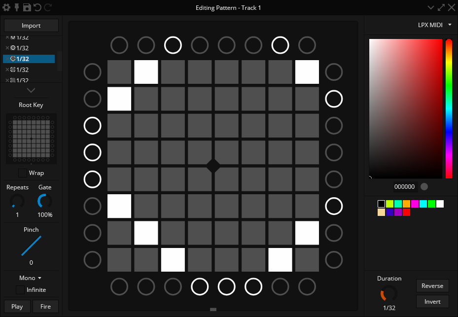

import DocLink from "@site/src/components/DocLink/DocLink";

# Apollo Studio

[Apollo Studio](https://apollo.mat1jaczyyy.com/) 是由 [mat1jaczyyy](https://mat1jaczyyy.com/) 开发的一款强大的灯光秀创作和表演工具。

使用 Apollo，你可以解锁和利用魔矩的许多功能，比如完全控制 LED 的 RGB 颜色。

## 设置步骤

1. 确保已安装 [Ableton Live](https://www.ableton.com/live/)，因为你很可能需要将 Apollo Studio 与它配合使用。你需要先设置魔矩与 Ableton 的连接。请参考 <DocLink to="/docs/Mystrix/UsageExamples/LightshowPerformance/AbletonLive">Ableton Live - 设置</DocLink> 获取指导。
2. 在电脑上下载并安装 [Apollo Studio](https://apollo.mat1jaczyyy.com/)。
3. 连接你的魔矩并进入 <DocLink to="/docs/MatrixOS/Applications/Performance">Performance 应用</DocLink>。
4. 同时启动 Apollo Studio 和 Ableton Live。
5. 打开现有项目或创建新项目。
6. 为轨道配置 MIDI 端口。注意 Windows 不支持多客户端 MIDI，所以需要选择 `MIDIIN2 (Mystrix)` 以避免与 Ableton Live 冲突。

<!-- idea: show the process in a gif? -->

想了解 Apollo Studio 的详细使用方法，可以查看 [Apollo 文档](https://github.com/mat1jaczyyy/apollo-studio/wiki) 或观看 [视频教程](https://www.youtube.com/playlist?list=PLKC4R3X00beY0aB_f_ZIa3shqJX7do4mH)。
