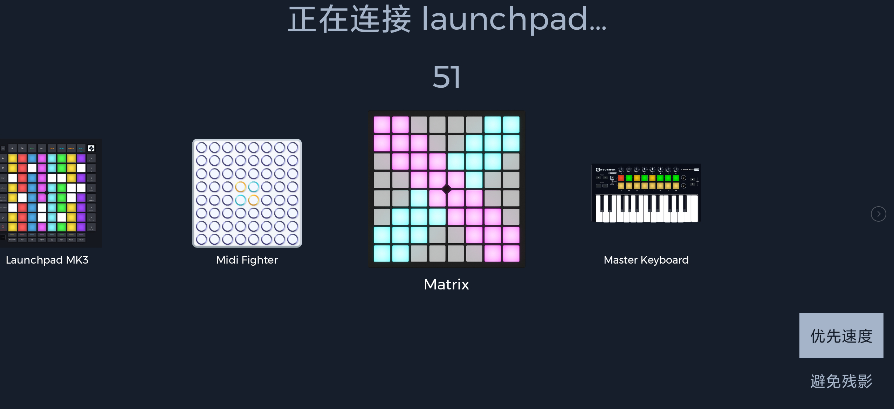

# Unipad

[Unipad](https://play.google.com/store/apps/details?id=com.kimjisub.launchpad&hl=en_US&pli=1) 是由 kimjisub 开发的 Android 应用。

Unipad 4.0 原生支持魔矩。只需将魔矩连接到你的 Android 设备并进入 [Performance 应用](/docs/MatrixOS/Applications/Performance)。

要查看如何连接的视频教程，请参考[此链接](https://www.youtube.com/watch?v=VYMQWO7jlws)。注意视频中显示的应用版本已过时，但操作步骤基本相同。

## 获取 Unipad 项目（UniPack）

Unipad 内置了商店，您可以在其中获取各种 Unipack。

您也可以从 YouTube 视频中获取 Unipad 项目。以下是一些精彩的例子：

- [Alan Walker - The Spectre by Clement Show](https://www.youtube.com/watch?v=-96eVsFJW-M)
- [BLACKPINK (블랙핑크) - 뚜두뚜두 (DDU-DU-DDU-DU) by JinCreeMusic](https://www.youtube.com/watch?v=QTsq8lM9uqg)
- [Porter Robinson & Madeon - Shelter by Clement Show](https://www.youtube.com/watch?v=TnPQg9h6Un0)
- [Fonglee, Moudelica & Silkorr - Midnight City by YamiEDM](https://www.youtube.com/watch?v=KYiaGXlBxLE)
- [Alan Walker - Darkside by Yubo Ki](https://www.youtube.com/watch?v=ZtSGblqfmKQ)

~~或从 [Unipad DB Kims](https://unipad.dbkims.com/) 等网站获取。~~ （目前已停止服务）