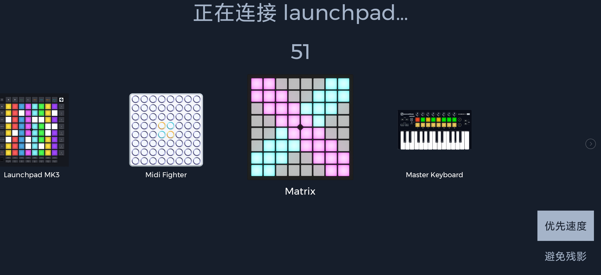

# Unipad

[Unipad](https://play.google.com/store/apps/details?id=com.kimjisub.launchpad&hl=en_US&pli=1) is an Android app developed by kimjisub.

Unipad 4.0 supports Mystrix natively. Simply connect Mystrix to your Android device and enter the [Performance App](/docs/MatrixOS/Applications/Performance).

For a video tutorial on how to connect, refer to [this link](https://www.youtube.com/watch?v=VYMQWO7jlws). Note that the app version shown is outdated, but the process remains largely the same.

## Get Unipad Projects (UniPack)

Unipad has a built-in store where you can obtain various Unipacks.

You can also get Unipad Projects from YouTube videos. Here are some great examples:

- [Alan Walker - The Spectre by Clement Show](https://www.youtube.com/watch?v=-96eVsFJW-M)
- [BLACKPINK (블랙핑크) - 뚜두뚜두 (DDU-DU-DDU-DU) by JinCreeMusic](https://www.youtube.com/watch?v=QTsq8lM9uqg)
- [Porter Robinson & Madeon - Shelter by Clement Show](https://www.youtube.com/watch?v=TnPQg9h6Un0)
- [Fonglee, Moudelica & Silkorr - Midnight City by YamiEDM](https://www.youtube.com/watch?v=KYiaGXlBxLE)
- [Alan Walker - Darkside by Yubo Ki](https://www.youtube.com/watch?v=ZtSGblqfmKQ)

~~Or from sites like [Unipad DB Kims](https://unipad.dbkims.com/).~~ (Currently down)
